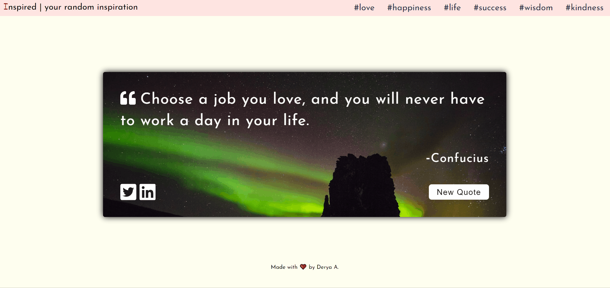

# Random Quote Machine React App

From [FreeCodeCamp's](https://www.freecodecamp.org/learn/front-end-libraries/front-end-libraries-projects/build-a-random-quote-machine) Front End Development Libraries Projects. It is a responsive react app fetching data from external APIs to present data for quotes. 

**I have upgraded the project with personalized UI and random background images using Axios and Unsplash API.**

## Screenshot of the Web App

## Live site
[Click Here!](https://d-antonelli.github.io/random-quote/)

